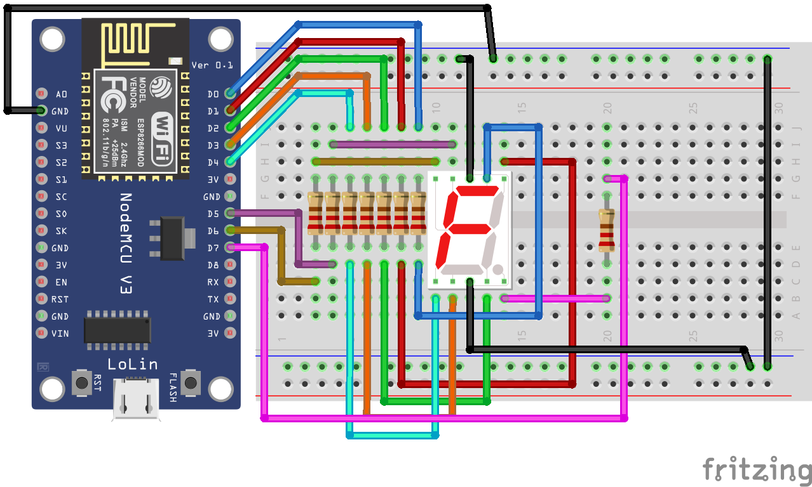
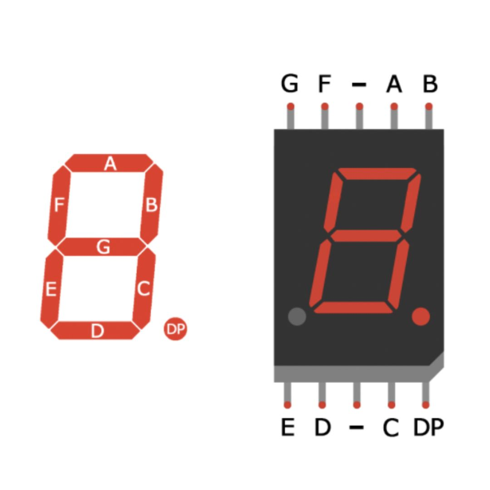

# Display de 7 Segmentos com Nodemcu

Este projeto é um exemplo básico de como controlar um display de 7 segmentos utilizando um Esp8266 nodemcu, mas com poucas adaptações funciona em quase todas as placas baseadas em Arduino.

Esse projeto demonstra como exibir números de 0 a 9 no display de 7 segmentos.



## Materiais Utilizados

- Nodemcu
- Display de 7 segmentos com anodo comum
- Resistores de 220ohms
- Jumpers ou cabos de conexão

## Pinagem do componente



## Montagem

1. Conecte o display de 7 segmentos aos pinos digitais do Nodemcu, observando a pinagem correta dos segmentos e do anodo comum seguindo a imagem de exemplo.
2. Conecte o Nodemcu ao computador utilizando um cabo USB.

## Configuração do Projeto

Use o [platformIO](https://platformio.org/) para facilitar o desenvolvimento e build do projeto. Abaixo alguns comandos úteis para usar a cli do platformIO, mas você pode utilizar o plugin com vscode ou outros IDEs que o plugin é compatível.

### Criando os arquivos de configuração para o vscode:

```shell
platformio init --ide vscode
```

### Instalação das Libs de dependências

```shell
pio run
```

### Upload e monitor para o arduino

```shell
pio run --target upload
```

```shell
pio device monitor
```
